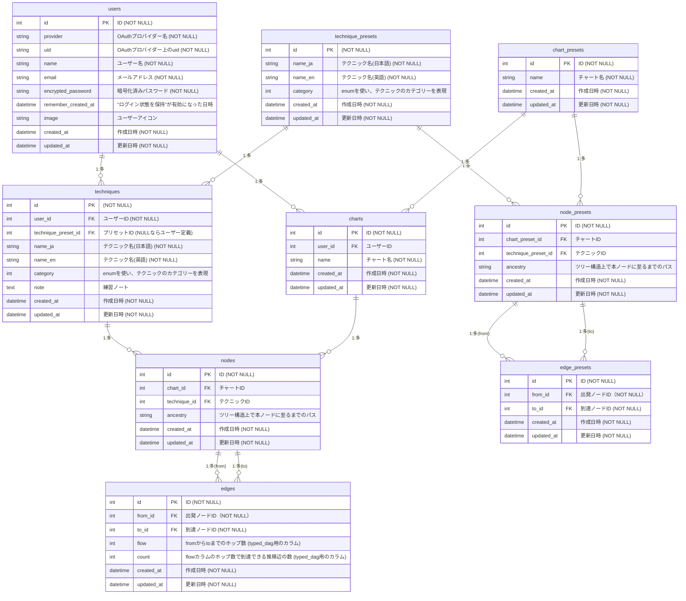

## サービス概要

BJJ Flow Tracker は、ブラジリアン柔術の練習メモを”試合およびスパーリングの流れ”に沿ったフロー図として記録・可視化できるサービスです。

ブラジリアン柔術のようなポジション遷移や状況判断が鍵となる競技において、個々のテクニックを「記憶した技」ではなく「試合の中で使える技」として身につける手助けをします。

個々のテクニックをフロー図に沿って状況ごとに整理することで、「いつ・どこで・どのようにそのテクニックを使うのか」が頭の中で整理され、スパーリングの「このポジションからの脱出、先週習ったのに思い出せない…」といった歯痒さをグッと減らすことができます。

## サービスを作りたい理由

前提として、ブラジリアン柔術のテクニックは、特定のポジションや状況でしか使用することができません。そのため実際の試合では、自身と相手の双方がスタンディングからスタートした後、「その技が使える状況」に自力で遷移する必要があります。

つまり、特定の技を「試合で使用できる技」にするにあたっては、単に技を覚えるだけでなく、試合開始からその技を使える状態までの流れ（フロー）も理解・整理する必要があると考えています。

その一方で、日々の練習記録はテクニックごとや日付ごとにまとめる人が多いように見受けられます（自分もその一人です！）。この練習記録の取り方では技同士の繋がりが見えづらく、試合やスパーリングに活用するには不十分であると感じていました。

この課題を解決するため、「技の記憶」と「状況遷移の整理」を結びつけて視覚的に整理できる本サービスの作成に思い至った次第です。

## ユーザー層について

- ブラジリアン柔術を上達させたいと思いながらも、練習記録のつけ方が分からず、日々の練習をただこなしてしまっている方
- 練習記録はつけているが、見返す機会がなく記録を活かせていない方
- 習ったテクニックがなかなか頭に残らないと感じている方

## サービス利用のイメージ

- 練習中に学んだことは、忘れないうちにクイックメモで素早く記録！後からじっくりフロー図に整理・集約することで、効率的にテクニックに関する学びを蓄積できます。
- 本サービスで作成したフロー図は、試合の流れに沿って自分の知見を整理・集約した「自分専用の練習記録帳」として機能します。日々の練習やスパーリングの中で常にこのフローを思い浮かべながら動くことで、実戦での判断や振り返りにも役立ち、記録を見返す習慣が自然と生まれます。

## ユーザーの獲得について

- 同じ道場に所属している会員に対して周知
- SNSを利用した拡散

## サービスの差別化ポイント・推しポイント

| 観点 | 他サービスとの違い | 本サービスの強み
| --------- | --------- | --------- | 
| **インタラクティブな情報反映** | 定番の試合展開をまとめた情報提供型サービスはあるが、ユーザー自身の気づきを記録することはできない。 | 自分の練習ノートをフローチャート形式で整理・可視化できる。|
| **使用ハードル**  | 「BJJフローチャート作成サービス」自体は僅かながら存在するが、ユーザーがゼロからテクニック及び動きを登録する必要がある。 | あらかじめプリセットとなるテクニックが登録されており、ユーザーは既存のテクニックを組み合わせるだけで自分の試合展開を構築できる。 |

## 機能

- ログイン機能
- テクニック一覧機能
- テクニック作成機能
- テクニック編集機能
- テクニック削除機能
- チャート一覧機能
- チャート作成機能
- チャート編集機能
- チャート削除機能
- ゲストログイン機能
- テクニックノート検索機能（インスタンス検索）
- 多言語(英語)対応
- PWA 対応
- テクニック・チャート共有機能（要検討）
- テクニックサンプル準備
- チャートサンプル準備

## 機能の実装方針

| 機能 / カテゴリー      | 技術                               |
| ---------------------- | ---------------------------------- |
| バックエンド           | Ruby on Rails 7.2.2.1 / Ruby 3.3.8 |
| フロントエンド         | JavaScript / Hotwire               |
| CSS フレームワーク     | Tailwind CSS / daisyUI             |
| 環境構築               | Docker                             |
| インフラ               | Render / Cloudflare                |
| データベース           | PostgreSQL                         |
| セレクトボックスUI     | tom-select                         |
| ステップガイド         | intro.js                           |
| チャート可視化         | G6                                 |
| ノードのツリー構造管理 | typed_dag                          |
| 認証機能               | Devise / OmniAuth-Google-OAuth2    |

## 画面遷移図

[Figma - 画面遷移図](https://www.figma.com/design/50XTJ2AdMyuF8x4kjTbcvT/BJJ-Flow-Tracker)

## ER 図

