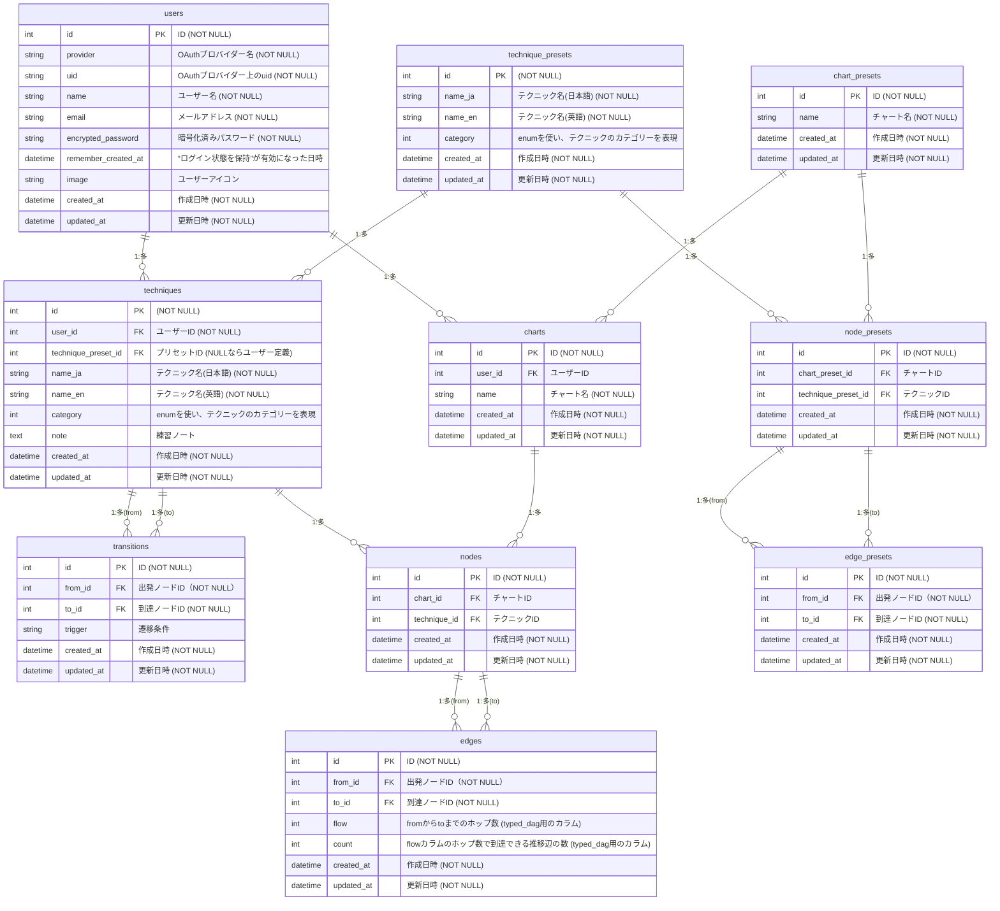

## ■ サービス概要
##### サービス名：BJJ Flow Tracker
##### サービスURL：https://bjjflowtracker.com/

BJJ Flow Tracker は、ブラジリアン柔術の練習メモを”試合およびスパーリングの流れ”に沿ったフロー図として記録・可視化できるサービスです。

ブラジリアン柔術のようなポジション遷移や状況判断が鍵となる競技において、個々のテクニックを「記憶した技」ではなく「試合の中で使える技」として身につける手助けをします。

個々のテクニックをフロー図に沿って状況ごとに整理することで、「いつ・どこで・どのようにそのテクニックを使うのか」が頭の中で整理され、スパーリングの「このポジションからの脱出、先週習ったのに思い出せない…」といった歯痒さをグッと減らすことができます。

## ■ 開発背景

前提として、ブラジリアン柔術のテクニックは、特定のポジションや状況でしか使用することができません。そのため実際の試合では、自身と相手の双方がスタンディングからスタートした後、「その技が使える状況」に自力で遷移する必要があります。

つまり、特定の技を「試合で使用できる技」にするにあたっては、単に技を覚えるだけでなく、試合開始からその技を使える状態までの流れ（フロー）も理解・整理する必要があると考えています。

しかしながら、試合の流れに着目して練習記録がとれるサービスは現状ほとんど存在していません。結果として、自分を含め多くの人がテクニック単位または日付単位で練習内容を整理しています。
この記録方法では技同士の繋がりが見えづらく、試合やスパーリングに活用にするは不十分であると感じていました。

この課題を解決するため、「技の記憶」と「状況遷移の整理」を結びつけて視覚的に整理できる本サービスの開発に思い至った次第です。

## ■ メインの対象ユーザー

- ブラジリアン柔術を上達させたいと思いながらも、練習記録のつけ方が分からず、日々の練習をただこなしてしまっている方
- 練習記録はつけているが、見返す機会がなく記録を活かせていない方
- 習ったテクニックがなかなか頭に残らないと感じている方

## ■ サービス利用のイメージ
1. Technique メニューで技を登録・整理

    技ごとに、動きのコツや気づきを記録することができます。プリセットとして90個以上のテクニックが初期登録されていますが、足りない場合は新規登録を行ってください。
2. Flow Chart メニューで技を繋ぎ、試合の展開(得意パターン)を可視化

    Technique メニューで登録した技同士を繋げて、試合の展開を可視化することができます。「この技の次にどの技が使えるか」を整理することで、復習・戦略立案に役立てることができます。

本サービスで作成したフロー図は、試合の流れに沿って自分の知見を整理・集約した「自分専用の練習記録帳」として機能します。日々の練習やスパーリングの中で常にこのフローを思い浮かべながら動くことで、実戦での判断や振り返りにも役立ち、記録を見返す習慣が自然と生まれます。

## ■ サービスの差別化ポイント・推しポイント

| 観点 | 他サービスとの違い | 本サービスの強み
| --------- | --------- | --------- | 
| **インタラクティブな情報反映** | 定番の試合展開をまとめた情報提供型サービスはあるが、ユーザー自身の気づきを記録することはできない。 | 自分の練習ノートをフローチャート形式で整理・可視化できる。|
| **使用ハードル**  | 「BJJフローチャート作成サービス」自体は僅かながら存在するが、ユーザーがゼロからテクニック及び動きを登録する必要がある。 | あらかじめプリセットとなるテクニックが登録されており、ユーザーは既存のテクニックを組み合わせるだけで自分の試合展開を構築できる。 |

## ■ 機能紹介

| ログイン |
| --- |
| 
 
 |
| Googleアカウントを使って簡単にログインすることができます。ひとまずサービスを体験したい場合は、Googleアカウントを使わずゲストとしてログインすることも可能です。 |

| ステップガイド |
| --- |
| 

 |
| 各ページにあるステップガイド開始ボタン、もしくはタイトル右隣にある <svg xmlns="http://www.w3.org/2000/svg" viewBox="0 0 24 24" width="1.5em" height="1.5em" fill="none" stroke="currentColor" stroke-width="1.5"><path stroke-linecap="round" stroke-linejoin="round" d="M9.879 7.519c1.171-1.025 3.071-1.025 4.242 0 1.172 1.025 1.172 2.687 0 3.712-.203.179-.43.326-.67.442-.745.361-1.45.999-1.45 1.827v.75M21 12a9 9 0 1 1-18 0 9 9 0 0 1 18 0Zm-9 5.25h.008v.008H12v-.008Z"/></svg> をクリックすると、そのページの概要と使い方を案内するステップガイドが始まります。これによって、初めての方でも迷わず画面を操作できます。|

| テクニック管理 |
| --- |
| 

 |
| それぞれの技に対して、気づきや動きのコツを記録できます。登録したテクニックは一覧から検索やカテゴリ別の絞り込みが可能。自分だけの「BJJノート」として知識を整理できます。 |

| チャート管理 |
| --- |
| 

 |
| 登録した技を繋げて、試合やスパーの展開を可視化することができます。さらに、各テクニック間の遷移条件（どんな状況からその技に移ることができるのか）を記録することで、戦略的な分析にも役立てることもできます。 |

| 言語(日英)切り替え |
| --- |
| 

 |
| 表示される言語を、日本語もしく英語に切り替えることができます（一部の固定ページは日本語のみの表示となります）。|

## ■ 技術スタック

| 機能 / カテゴリー      | 技術                               |
| ---------------------- | ---------------------------------- |
| バックエンド           | Ruby on Rails 7.2.2.1 / Ruby 3.3.8 |
| フロントエンド         | JavaScript / Hotwire               |
| CSS フレームワーク     | Tailwind CSS / daisyUI             |
| 環境構築               | Docker                             |
| インフラ               | Render / Cloudflare                |
| データベース           | PostgreSQL                         |
| セレクトボックスUI     | tom-select                         |
| ステップガイド         | Driver.js                          |
| チャート可視化         | G6                                 |
| ノードのツリー構造管理 | typed_dag                          |
| 認証機能               | Devise / OmniAuth-Google-OAuth2    |

## ■ 画面遷移図

[Figma - 画面遷移図](https://www.figma.com/design/50XTJ2AdMyuF8x4kjTbcvT/BJJ-Flow-Tracker)

## ■ ER 図

